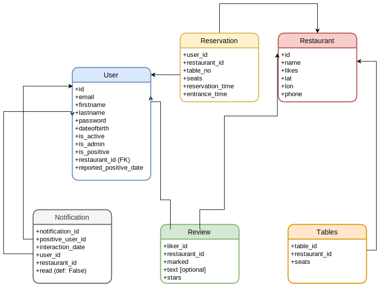

[](https://travis-ci.com/NickLucche/ase-20-GoOutSafe)
# Advanced Software Engineering Monolith Project-GoOutSafe
`todo: add names`

# DB schemes

```sqlite
CREATE TABLE user (
    id INTEGER NOT NULL, 
    email VARCHAR(128) NOT NULL, 
    firstname VARCHAR(128), 
    lastname VARCHAR(128), 
    password VARCHAR(128), 
    dateofbirth DATETIME, 
    is_active BOOLEAN, 
    is_admin BOOLEAN, 
    PRIMARY KEY (id), 
    CHECK (is_active IN (0, 1)), 
    CHECK (is_admin IN (0, 1))
);
CREATE TABLE restaurant (
    id INTEGER NOT NULL, 
    name TEXT(100), 
    likes INTEGER, 
    lat FLOAT, 
    lon FLOAT, 
    phone INTEGER, 
    PRIMARY KEY (id)
);
CREATE TABLE IF NOT EXISTS "like" (
    liker_id INTEGER NOT NULL, 
    restaurant_id INTEGER NOT NULL, 
    marked BOOLEAN, 
    PRIMARY KEY (liker_id, restaurant_id), 
    FOREIGN KEY(liker_id) REFERENCES user (id), 
    FOREIGN KEY(restaurant_id) REFERENCES restaurant (id), 
    CHECK (marked IN (0, 1))
);
```
# DB diagram


