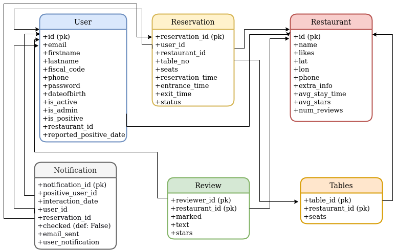

# Advanced Software Engineering Monolith Project-GoOutSafe
---
- Nicolo' Lucchesi
- Lorenzo Rasoini
- Marco Costa
- Mattia Odorisio
- Mario Saracino
- Dawit Mezemir Anelay

# Usage
---
To run the app, make sure to have a redis instance running on port `6379`. We provide a docker-compose file for running both the web app and a vanilla redis container, start with `docker-compose up -d`.
In order to use asynchronous task, Celery must be started with the command `celery -A monolith.background worker --loglevel=INFO -B` or through the simple bash script `start_celery.sh`.
App will then be listening on port `5000` by default.

To run tests locally, run command `python -m pytest --cov-report term-missing --cov=monolith monolith/` after completing the steps above.

# DB diagram
---

